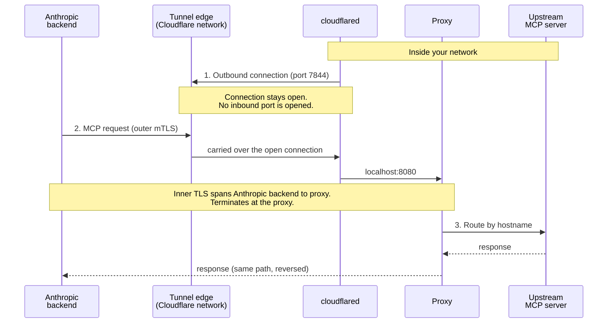

<Note>
  MCP 隧道目前处于研究预览阶段。[申请访问权限](https://claude.com/form/claude-managed-agents)以试用。
</Note>

本页定义了 [MCP 隧道](https://platform.claude.com/docs/zh-CN/agents-and-tools/mcp-tunnels/overview)文档中通篇使用的术语。若干组件在配置文件、容器镜像和正文中以不同的名称出现；下表为每个组件给出一个规范名称，并列出您可能遇到的别名。

## 组件

| 术语                                  | 定义                                                                                                                                                 | 也称为                                                                                                                             |
| ----------------------------------- | -------------------------------------------------------------------------------------------------------------------------------------------------- | ------------------------------------------------------------------------------------------------------------------------------- |
| **Tunnel stack（隧道栈）**               | 您在自己的网络内运行、用于接入隧道的两个容器：proxy 和 cloudflared。一个栈服务于一条隧道，并可跨主机复制以提高可用性。在使用编程访问时，setup 组件与栈一同运行以配置凭据。                                                  | the stack、the MCP tunnel stack、the tunnel deployment、your deployment                                                            |
| **Proxy（代理）**                       | Anthropic 的路由组件。终止 inner TLS（内层 TLS），验证上游 IP 是否落在允许的范围内，并根据主机名将每个请求路由到上游 MCP 服务器。                                                                  | `mcp-proxy`（镜像名称、Compose 服务名称和 Helm 容器名称）、`mcp-gateway`（容器内部配置路径 `/etc/mcp-gateway/config.yaml` 以及 Helm `gateway.config.*` 值前缀） |
| **cloudflared**                     | Cloudflare 的开源隧道连接器。从您的网络向隧道边缘发起仅出站的连接，并在边缘与 proxy 之间承载加密流量。与 Managed Agent 无关。                                                                    | the outbound connector、the tunnel connector                                                                                     |
| **Setup component（setup 组件）**       | `setup` 二进制文件，随 `mcp-proxy` 镜像一同提供。在使用编程访问时，它通过 Workload Identity Federation 进行身份验证、获取隧道令牌、生成 CA 和服务器证书，并向 Anthropic 注册该 CA。还提供 `renew-cert`。      | setup Job（Helm pre-install 钩子）、`setup` 服务（Compose profile）、setup hook、setup binary、setup CLI                                    |
| **Tunnel edge（隧道边缘）**               | cloudflared 向外拨出连接的 Cloudflare 边缘服务器（IP 范围 `198.41.192.0/19` 和 `2606:4700:a0::/44`，端口 7844 TCP 和 UDP）。运行在其上的隧道由 Anthropic 配置和控制；Cloudflare 运营底层网络。 | the edge、the Anthropic-operated tunnel edge                                                                                     |
| **Inner TLS（内层 TLS）**               | 在隧道的明文 WebSocket 流内部承载的第二次 TLS 握手，发生在 Anthropic 的后端与您的 proxy 之间。proxy 出示一张由您在隧道上注册的 CA 签发的服务器证书。由于只有您持有私钥，传输提供方无法读取请求或响应的有效载荷。                     | the inner TLS handshake                                                                                                         |
| **Upstream MCP server（上游 MCP 服务器）** | 运行在您的私有网络中、由 proxy 路由到的 MCP 服务器。每个上游作为您的隧道域名下的一个子域名对外暴露。                                                                                           | upstream、routed MCP server、tunneled MCP server                                                                                  |

## 凭据配置

隧道栈在运行时需要两项凭据：**tunnel token（隧道令牌）**，用于验证 cloudflared 的出站连接；以及一张由在隧道上注册的 CA 签发的 **server certificate（服务器证书）**，由 proxy 在内层 TLS 握手期间出示。提供它们有两种方式，在本指南中通篇以一对选项卡的形式呈现。

| 模式                            | 凭据如何到达栈                                                                                                                                                                                                                                      | Helm chart 名称                         | 选项卡标签                           |
| ----------------------------- | -------------------------------------------------------------------------------------------------------------------------------------------------------------------------------------------------------------------------------------------- | ------------------------------------- | ------------------------------- |
| **Programmatic access（编程访问）** | setup 组件通过 [Workload Identity Federation](https://platform.claude.com/docs/zh-CN/manage-claude/workload-identity-federation) 向 Tunnels API 进行身份验证，获取隧道令牌，在本地生成 CA 和服务器证书，并注册该 CA。无需手动复制任何长期有效的密钥。需要一条具有 `workspace:manage_tunnels` 作用域的联合规则。 | Managed 模式（`setup.enabled: true`，默认值） | **With programmatic access**    |
| **Manual（手动）**                | 您从 Claude Console 复制隧道令牌，自行生成 CA 和服务器证书（例如使用 `openssl`），在 Console 中注册该 CA，并将令牌和证书作为 secret 提供给栈。不运行 setup 组件。                                                                                                                                | External 模式（`setup.enabled: false`）   | **Without programmatic access** |

在部署指南中，这两种模式也被称为 **the programmatic flow（编程流程）** 和 **the manual flow（手动流程）**。

## 连接模型

隧道中有两个方向在起作用，且它们指向相反：

* **连接方向：** cloudflared 从您的网络向隧道边缘**出站**拨出。您的防火墙只会看到端口 7844 上的出口流量；不会打开任何入站端口。
* **请求方向：** 一旦该连接建立，MCP 请求便经由它**从 Anthropic 流向您的网络**，经过 cloudflared 到达 proxy，再到上游 MCP 服务器。

"outbound-only"（仅出站）一词描述的是连接，而不是其上承载的请求。

内层 TLS 横跨 Anthropic 的后端与您的 proxy。cloudflared 和隧道边缘在线路上位于二者之间，但只能看到密文；proxy 是您网络内部第一个可以读取 MCP 请求有效载荷的位置。

## 另请参阅

* [MCP 隧道](https://platform.claude.com/docs/zh-CN/agents-and-tools/mcp-tunnels/overview)，了解安全模型和共担责任表。
* [MCP 隧道参考](https://platform.claude.com/docs/zh-CN/agents-and-tools/mcp-tunnels/reference)，了解 proxy 配置字段、证书要求和 setup 组件。
