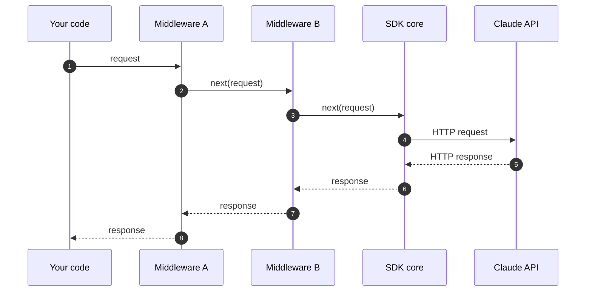

Anthropic SDK 提供了一个 "middleware"（中间件）（或称 "interceptor"，拦截器）钩子，让您可以在请求发送之前和响应接收之后运行代码。中间件适用于横切关注点，例如日志记录、自定义重试、请求标注以及拒绝回退处理。



每个中间件都可以在调用 `next()` 之前检查或替换请求，并在 `next()` 返回之后检查或替换响应。

## 注册中间件

每个中间件都是一个函数，接收传出的请求和一个 `next` 可调用对象。调用 `next` 可将请求转发给链中的其余部分（如果这是最后一个中间件，则直接转发给 SDK 核心），并返回其响应。`next` 调用之前的任何代码在请求发出时运行；之后的任何代码在响应返回时运行。

<CodeGroup exclude="shell">
  ```python Python
  def logging_middleware(request: APIRequest, call_next: CallNext) -> APIResponse[Any]:
      # 请求之前
      print(f"-> {request.method} {request.url}")

      # 将请求转发给链的其余部分
      response = call_next(request)

      # 请求之后
      print(f"<- {response.status_code}")

      return response


  client = Anthropic(middleware=[logging_middleware])
  ```

  ```typescript TypeScript
  import type { Middleware } from "@anthropic-ai/sdk";

  const loggingMiddleware: Middleware = async (request, next, ctx) => {
    // 请求之前
    ctx.logger.debug("->", request.method, request.url);

    // 将请求转发给链的其余部分
    const response = await next(request);

    // 请求之后
    ctx.logger.debug("<-", response.status, request.url);

    return response;
  };

  const client = new Anthropic({ middleware: [loggingMiddleware] });
  ```

  ```csharp C#
  AnthropicClient client = new()
  {
      Handlers =
      [
          Handler.Create(async (request, next, cancellationToken) =>
          {
              // 请求之前
              Console.WriteLine($"Sending {request.Method} {request.RequestUri}");

              // 将请求转发给下一个处理程序
              var response = await next(request, cancellationToken);

              // 请求之后
              Console.WriteLine($"Received {(int)response.StatusCode}");

              return response;
          }),
      ],
  };
  ```

  ```go Go
  client := anthropic.NewClient(
  	option.WithMiddleware(func(req *http.Request, next option.MiddlewareNext) (*http.Response, error) {
  		// 请求之前
  		start := time.Now()
  		slog.Info("sending request", "method", req.Method, "url", req.URL)

  		// 将请求转发给链的其余部分
  		res, err := next(req)
  		if err != nil {
  			return nil, err
  		}

  		// 请求之后
  		slog.Info("received response", "status", res.StatusCode, "duration", time.Since(start))

  		return res, nil
  	}),
  )
  ```

  ```java Java
  AnthropicClient client = AnthropicOkHttpClient.builder()
      .fromEnv()
      .addInterceptor(Interceptor.syncOnly((nextClient, request, requestOptions) -> {
          // 请求之前
          IO.println(request.method() + " /" + String.join("/", request.pathSegments()));

          // 将请求转发给下一个处理程序
          HttpResponse response = nextClient.execute(request, requestOptions);

          // 请求之后
          IO.println(response.statusCode());

          return response;
      }))
      .build();
  ```

  ```php PHP
  $loggingMiddleware = function (RequestInterface $request, callable $next): ResponseInterface {
      // 请求之前
      error_log("-> {$request->getMethod()} {$request->getUri()}");

      // 将请求转发给链的其余部分
      $response = $next($request);

      // 请求之后
      error_log("<- {$response->getStatusCode()}");

      return $response;
  };

  $client = new Client(requestOptions: ['middleware' => [$loggingMiddleware]]);
  ```

  ```ruby Ruby
  logging_middleware = lambda do |request, call_next|
    # 请求之前
    puts "-> #{request.method.upcase} #{request.url}"

    # 将请求转发给链的其余部分
    response = call_next.call(request)

    # 请求之后
    puts "<- #{response.status}"

    response
  end

  client = Anthropic::Client.new(middleware: [logging_middleware])
  ```
</CodeGroup>

## 中间件顺序

当您注册多个中间件时，它们按给定的顺序应用：第一个中间件的"前置"代码最先运行，其"后置"代码最后运行。在客户端上注册的中间件先于作为单次请求选项传入的中间件运行。

在 Go SDK 中，重复调用 `option.WithMiddleware` 会进行拼接（先客户端，后方法）。在其他 SDK 中，请传入一个数组；靠后的条目包裹在内层。

## 替换 HTTP 客户端

每个 SDK 还接受自定义 HTTP 客户端（用于代理配置、自定义 TLS 或连接池）。每个 SDK 客户端只使用一个 HTTP 客户端；设置它会替换默认客户端。自定义 HTTP 客户端在所有中间件运行完毕后接收请求。

## 内置中间件

SDK 附带一个拒绝回退中间件，可自动在回退模型上重试被 Claude Fable 5 拒绝的请求。有关设置和各语言示例，请参阅[检测并在回退模型上重试](https://platform.claude.com/docs/zh-CN/build-with-claude/refusals-and-fallback#client-side-fallback)。
